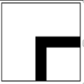

# Line Tracer (TI RSLK MAX)
##  Path-finding Algorithms

The path-finding algorithim implemented in this project is followed by flag value status in order to decide which operation will be done in each precise moment. 

Flag variable(`pop`) is used as a signal in programming to let the progam know that a certain condition has been met. It acts as a Boolean variable indicating that a condition is true or false. Flag variable `pop` will be false if the path is a new instersection and true if it has already been visited.

The QRTX sensor has the duty to recognize between black and white.

If the path is white, it means there is no path to continue, we set the flag variable `pop` to true and make the robot rotate 180˚. If the sensor recognizes black, it is define that there is path to follow so the robot will move forward.

The 3x3 maze consist of different types of tiles described on table.

In our path-finding implementation, we met an intersection and if the status of 'pop` is 0, it is a new intersection. Then we push the intersection information onto the stack.

On the other hand if we look at the value of the flag and it has a value of 1, we confirm that the intersection has already been visited before, the flag variable is true, so the intersection information will pop. After the stack operation has been done, it is proceeded do the set routine defined by that case.

| ***\**Maze tiles\*\****               | ***\*Step 1\**** | ***\*Step 2\**** | ***\*Step 3\**** |
| ------------------------------------- | ---------------- | ---------------- | ---------------- |
|  | Go Straight      |                  |                  |
|  | Go Left          |                  |                  |
|  | Go Right         |                  |                  |
|  | Go Straight      | Turn Right       | Turn Right       |
|  | Go Straight      | Turn Right       |                  |
|  | Go Right         | Go Straight      | Turn Right       |
|  | Go Left          | Turn Right       | Go Straight      |


## Motor Control Algorithms

We operated the motor using a Timer interrupt. It is a method of generating PWM signals using a timer. As the PWM pin of the motor is connected to the 3 and 4 submodules of timer0, values of Duty 3 and 4 are passed to motors 3 and 4 during the PWM initialization process. The `leftDuty` and `rightDuty` values are input as the `Move()` function, and the `rightDuty` value is handed over to `PWM_Duty3()` and the `leftDuty` value is handed over to `PWM_Duty4()`.

The `Left_Forward()` function refers to the straight movement of the left motor, the `Left_Backward()` function refers to the backward movement of the left motor, the `Right_Forward()` function refers to the straight movement of the right motor, and the `Right_Backward()` function refers to the backward movement of the right motor.

 

### Straight

`Left_Forward()` and `Right_Forward()` functions operate, and the `Move()` functions are given a duty of `950` and `955`. `Clock_Delay1ms()` was set to `10`. If the `IN` of the IR sensor is `0x18`, it goes straight.

 

### Stop

`Move()` function was constructed by giving a duty of `0`. `Clock_Delay1ms()` was set to `10`. If the `IN` of the IR sensor is `0x3C`, it stops.

 

### Turn Right

`Left_Forward()` and `Right_Backward()` functions operate, and the `Move()` functions are given a duty of `1645`, `1650`. `Clock_Delay1ms()` was set to `1500`. In this case, the robot rotates 90 degrees to the right and then stops. When the `IN` of the IR sensor is `0x1F`, if any of the `0x06` is recognized (bitwise and), it turns right.

 

### Turn Left

`Left_Backward()` and `Right_Forward()` functions are operated, and the `Move()` functions are given a duty of `1650` and `1645`. It was set to `Clock_Delay1ms()` `1500`. In this case, the robot rotates 90 degrees to the left and then stops. When the `IN` of the IR sensor is `0xF8`, if any of the `0x60` is recognized (bitwise and), it turns left.

 

### Rotate

In the algorithm, it was necessary to rotate 180 degrees, so the back part was implemented. `Left_Forward()` and `Right_Backward()` operated to rotate to the right and and the `Move()` functions are given a duty of `1650` and `1650`. `Clock_Delay1ms()` was set to `3600`. In this case, the robot is rotated 180 degrees. If the `IR` sensor does not recognize anything, it rotates.

 

### Correction

The correction value was set in preparation for an error that occurs when the robot deviates from the line. If the `IN` of the IR sensor is `0x18` and only `0x08` is recognized, it means the robot makes a slight shift to the left. Then we give a little turning right value to be driven straight again. Conversely, if the `IR` sensor only recognizes `0x10`, it means the robot makes a slight shift to the left. Then we give a little turning left value like before.


## Entire Logic of the Program

``` c
int stack[100];		// stack
int top = 0;		// index of top of stack
int pop = 0;		// pop flag
int direction = -1;	// moving direction
```

Since the entire algorithm is implemented through a stack, variables related to the stack were defined.

In addition, `direction`, a variable for indicating the direction in which the robot moves, was defined.


### Go()

``` c
void Go(int direction)
{
    if(direction == 0) // left
    {
        Left_Forward();
        Right_Forward();
        Move(950, 960);
        printf("straight\n");
        Clock_Delay1ms(100);

        P5->OUT &= ~0x08;
        P9->OUT &= ~0x04;

        Right_Forward();
        Left_Backward();
        Move(1650, 1645);
        printf("left\n");
        Clock_Delay1ms(1500);

    }
    else if(direction == 1) // right
    {
        Left_Forward();
        Right_Forward();
        Move(950, 960);
        printf("straight\n");
        Clock_Delay1ms(100);

        P5->OUT &= ~0x08;
        P9->OUT &= ~0x04;

        Left_Forward();
        Right_Backward();
        Move(1645, 1650);
        printf("right\n");
        //Clock_Delay1ms(1500);
    }
    else if(direction == 2) // straight
    {
        Left_Forward();
        Right_Forward();
        Move(950, 955);
        printf("stra\n");
        Clock_Delay1ms(10);
    }
    else if(direction == 3) // stop
    {
        Left_Forward();
        Right_Forward();
        Move(0, 0);
        printf("stop\n");
        Clock_Delay1ms(10);
    }
    else if(direction == 4) // back
    {
        Left_Forward();
        Right_Backward();
        Move(1650, 1650);
        Clock_Delay1ms(3600);
    }
    else // error
    {
        printf("ERROR!\n");
    }

}
```

The `Go()` function receives `direction` as a factor and moves the robot in a designated direction.

If `direction` is 0, go left, 1 goes right, 2 goes straight, 3 goes stop, and 4 goes backward. Other cases were treated as errors.


### Push()

``` c
void Push(int direction)
{
    stack[top] = direction;
    top += 1;
}
```

`Push()` is a function that pushes `direction` in the stack.

In this case, direction means `ㅏ` at 1, `ㅓ` at 2, `ㅜ`(first time) at 33, `ㅜ`(second time) at 3, `+`(first time) at 44, and `+`(second time) at 4.

Push the number suitable for the current situation given to the robot to the top of stack and increase the `top` by 1.


### Pop()

``` c
int Pop()
{
    direction = stack[top];
    top -= 1;
    pop = 0;

    if(direction == 1)
    {
        direction = 0; // Left
    }
    else if(direction == 2 || direction == 3)
    {
        direction = 1; // Right
    }
    else if(direction == 4)
    {
        direction = 2; // Straight
    }
    else if(direction == 33)
    {
        direction = 2; // Straight
        Push(3);
    }
    else if(direction == 44)
    {
        direction = 1; // Right
        Push(4);
    }
    return direction;
}
```

`Pop()` is a function that pops `direction` in a stack.

Take out one `direction` from the top of stack, clear the `pop` flag, and reduce the `top` by one.


Depending on the `direction` in the stack, the next direction to go varies. Change the value of `direction` according to the conditions and return it.

If `direction` is 33(`ㅜ`) or 44(`+`), there are other directions to be explored when the goal is not found and returned to the corresponding intersection, so 3 and 4 were pushed to the stack, respectively.

The returned direction is put in `Go()` and the robot moves in that direction.


### main()

First, the value received from the sensor is masked through the `&` operation.

``` c
sensor_start = P7->IN & 0x7E;		// 0111 1110
sensor_stop = P7->IN & 0x3C;		// 0011 1100
sensor_straight = P7->IN & 0x18;	// 0001 1000
sensor_right = P7->IN & 0x1F;		// 0001 1111
sensor_left = P7->IN & 0xF8;		// 1111 1000
```

After masking, move the robot according to whether the line enters the sensor in the remaining position.


``` c
if(sensor_start == 0x7E)
{
    Go(2);
    printf("START\n");
}
else if(sensor_stop == 0x3C )
{
    Go(3);
    printf("STOP\n");
    break;
}
else if(sensor_straight == 0x18)
{
    Go(2);
    printf("FORWARD\n");
}
```

The start, end, and straight lines are designed to operate when the values masked above exactly match the sensors of the robot.

The robot was moved by putting a value in the `Go()` that fits the direction it should go.


``` c
else if(sensor_straight == 0x08)
{
    Left_Forward();
    Right_Backward();
    Move(1975, 1980);
    printf("R_FIX\n");
    Clock_Delay1ms(50);
}
else if(sensor_straight == 0x10)
{
    Right_Forward();
    Left_Backward();
    Move(1975, 1980);
    printf("L_FIX\n");
    Clock_Delay1ms(50);
}
```

This part is the part that corrects the direction.

In `sensor_straight`, two sensors in the middle must be recognized to go straight, but if only one of them is recognized, the robot's direction is wrong, so it was corrected.


``` c
else if(sensor_right & 0x06)
{
    if(cnt < 5)
    {
        Go(2);
        printf("PROTECT\n");
    }
    else
    {
        Go(1);
        printf("RIGHT\n");
    }
}
else if(sensor_left & 0x60)
{
    if(cnt < 5)
    {
        Go(2);
        printf("PROTECT\n");
    }
    else
    {
        Go(0);
        printf("LEFT\n");
    }
}
```

This part is about turning left and right.

It is possible to rotate even if only a part of `sensor_right` and `sensor_left` is recognized.


The if statement with `cnt` is a protection code inserted to prevent the robot from rotating due to the shaking when the robot was initially placed.


``` c
else // Intersection or Blank space
{
    if(pop == 1)
    {
        direction = Pop();
        Go(direction);
    }
    else if(pop == 0)
    {
        if(sensor_left & 0xC0) // ㅏ
        {
            Push(1);
        }
        else if(sensor_right & 0x03) // ㅓ
        {
            Push(2);
        }
        else if(sensor_left==0xF8 && sensor_right==0x1F) // ㅜ
        {
            Push(33);
        }
        else if(sensor_straight == 0x18 && sensor_left == 0xF8 && sensor_right == 0x1F ) // +
        {
            Push(44);
        }
        else
        {
            pop = 1;
            Go(4);
            printf("turn around\n");
        }
    }
}
```

This part is the code that is executed when a space or an intersection is encountered.


First, check the `pop` flag. The `pop` flag is set when robots turn around and go back without finding a goal in the last else statement.

Basically, if robot can go in several directions rather than in one direction, robot pushes direction on the stack, but if the `pop` flag is set, robot does pop without pushing.


If the `pop` flag is set, take out a `direction` from the top of stack and move the robot in that direction.

If the `pop` flag is clear, push the direction corresponding to the current intersection to the stack.